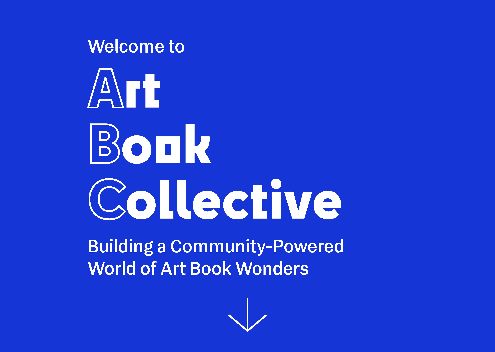

# IndieArt Project 

# Description: 

### This project aims to create an aggregator of artbooks published by independent small presses. The projects aims to address the problem of a highly fragmented marketplace of niche books currently relying on social media, stand-alone websites and in-person bookfairs to sell and purchase books.. The project will seek to automate the aggregation of listings about artbooks and specialized artbook fairs, presented in a beautiful online setting worthy of the art books that are being featured while also sharing information about bookfairs. 

# Technology Used: 
- React
  - Bootstrap, Icons
- Typescript
- Postgresql (using Supabase)
- Node
- Express

# Additional Tools Used:
- Python
  - BeautifulSoup, Requests, Regex
- Prisma ORM

# Running the application:
- Client: A React based code filed
  - From the root directory, change directory to "client" folder
  - Start by running "npm i"
  - Run the front end in dev mode by entering "npm run dev"
- Server: A Node based code file
  - From the root directory, change directory to "server" folder
  - Start by running "npm i"
  - Run the back end in dev mode by entering "npm run dev"

- Both the "client" and "server" should run simultaneously 

# Landing Page of Our Project

# Home Page

